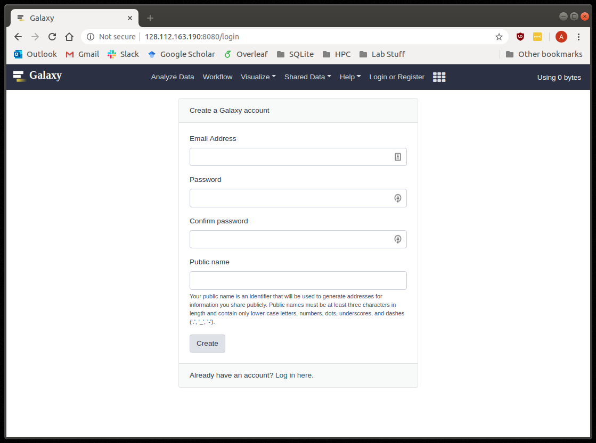
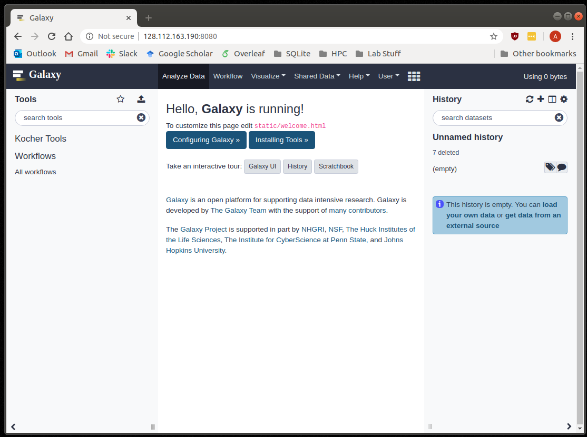
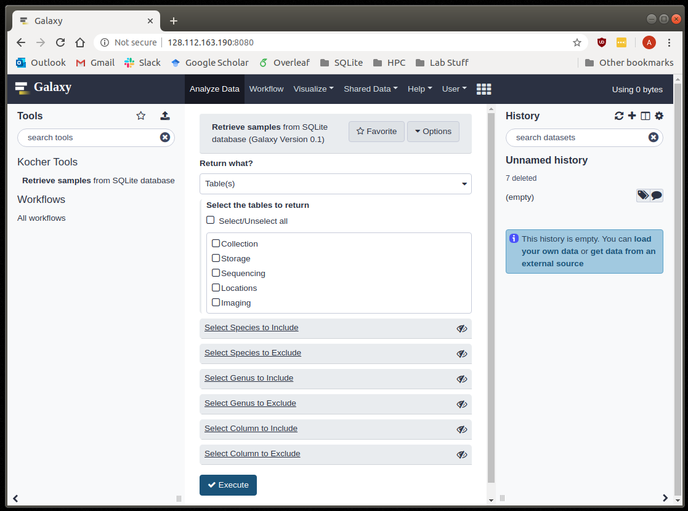

Kocher Galaxy Server
====================

Create your account
-------------------
Unlike `usegalaxy.org <https://usegalaxy.org/>`_, the Kocher Galaxy Server requires all users to have an account. To create an account, click on the link **Register here.** as seen on :numref:`Fig. %s <Account>`.

     
    Login Page

Where are the tools?
--------------------
Once you've created your account and logged in, the Homepage :numref:`(Fig. %s) <Homepage>` of the Kocher Galaxy Server should be displayed. To access the tools currently on the server, select **Kocher Tools** on the left sidebar. Once selected, the currently available tools will be listed below.

     
    Kocher Galaxy Server Homepage

Query the SQL server
--------------------
To query the Kocher lab SQL database, select **Retrieve samples** *from SQLite database** on the left sidebar. Once selected, you should see the following page :numref:`(Fig. %s) <Retrieve>`. To query the server you are first required to indicate what you want returned (i.e. **Return what?**). In the current version, this may be one or more tables/columns in the database. Once the returned data is selected, you may filter the returned data with the include/exclude optional arguments found below. In the current version, specalized include/exclude arguments are provided for: **Sample ID**, **Species**, **Genus**, and **Samples from nests**. Samples may be filtered by other information using **Include/Exclude Column**, which require the column be selected from a dropdown menu alongside a specified value. Please note: if no filters are selected, all samples will be returned.   

     
    Retrieve samples Page

