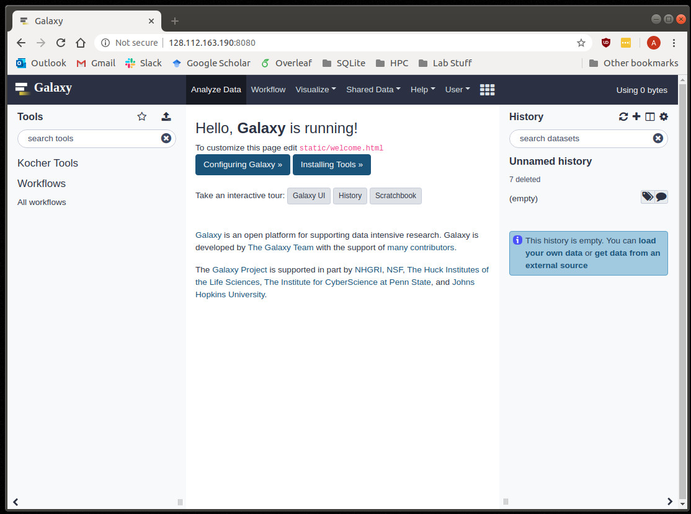
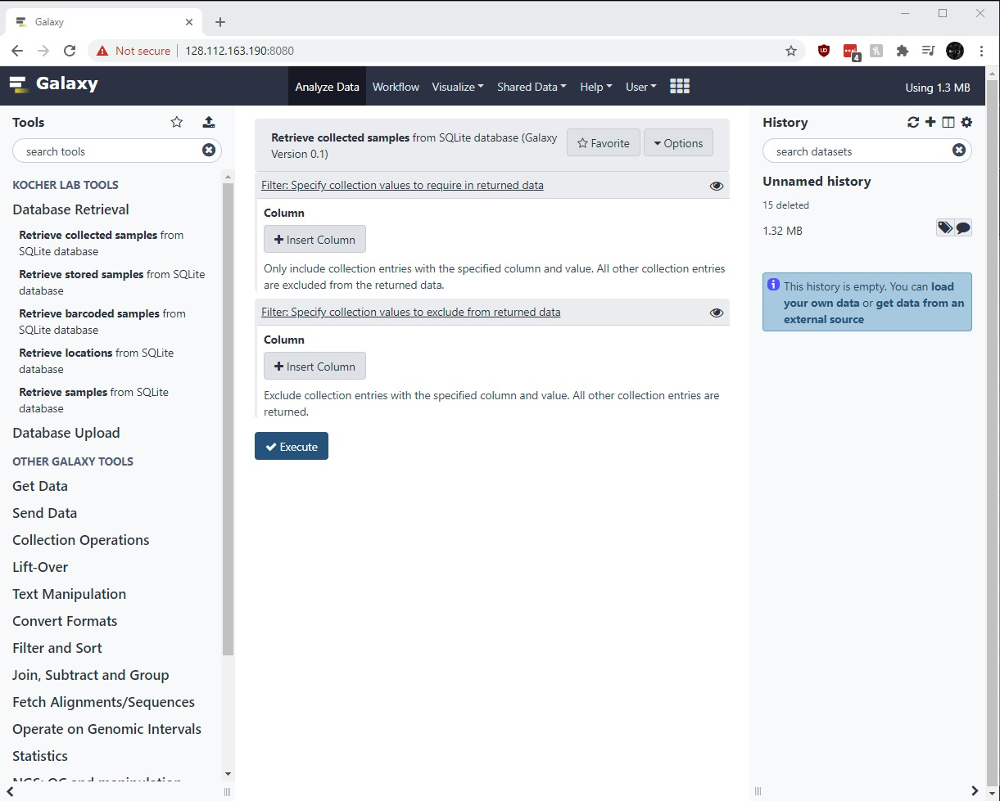
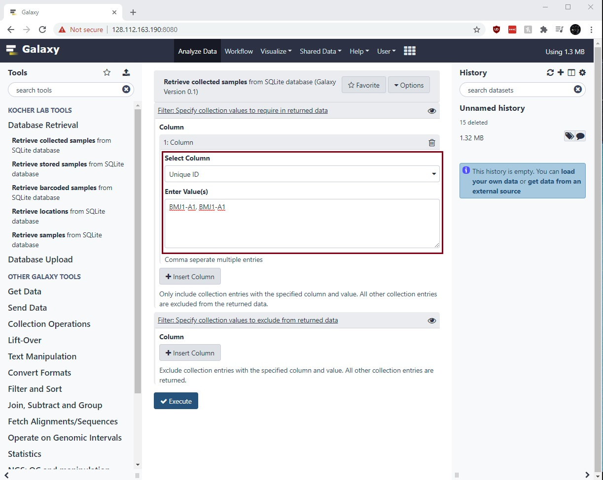
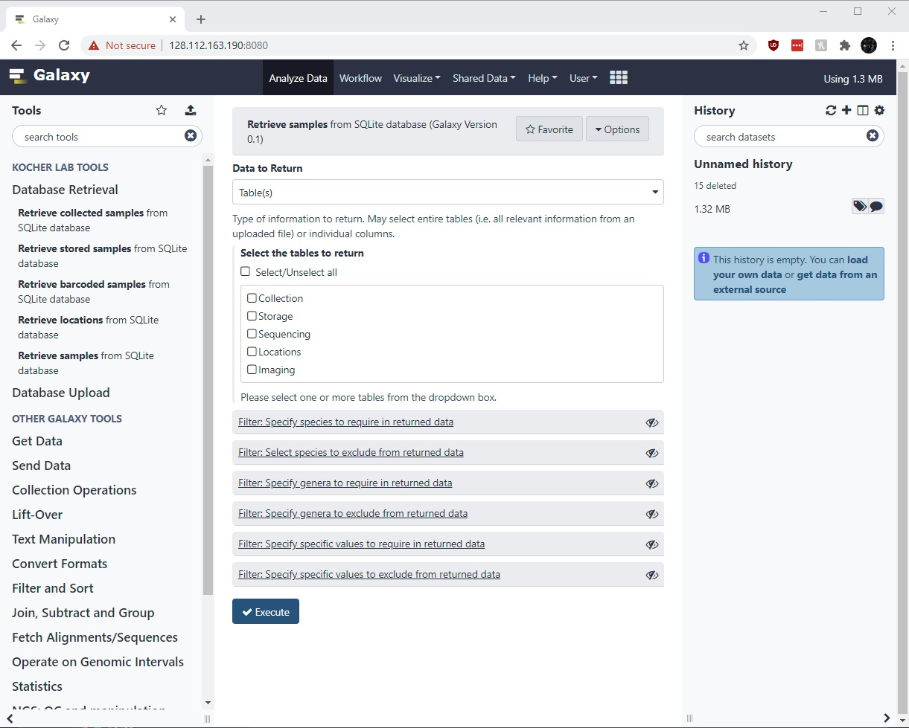

Kocher Galaxy Server
====================

Create your account
-------------------
Unlike `usegalaxy.org <https://usegalaxy.org/>`_, the Kocher Galaxy Server requires all users to have an account. To create an account, click on the link **Register here.** as seen on :numref:`Fig. %s <Account>`.

     
    Login Page

Where are the tools?
--------------------
Once you've created your account and logged in, the Homepage :numref:`(Fig. %s) <Homepage>` of the Kocher Galaxy Server should be displayed. You may find the current lab tools under the heading **KOCHER LAB TOOLS** on the left sidebar. To access the tools currently on the server, select **Database Retrieval** or **Database Upload**. Once selected, the currently available tools will be listed below.

     
    Kocher Galaxy Server Homepage

Query the SQL server
--------------------
To query the Kocher lab SQL database, you may select from the basic retrieval tools (**Retrieve collected samples**, **Retrieve stored samples**, **Retrieve barcoded samples**, and **Retrieve locations**) or the general retrieval tool (**Retrieve samples**). The basic retrieval tools by default will only return relevant columns (i.e. storage information, barcoding/sequencing information, etc) whereas the general retrieval tool will by default return all columns.

Basic Retrieval
---------------
Once a basic retrieval tool has been selected, you should see the following page :numref:`(Fig. %s) <Basic_Retrieve>`.

     
    Retrieve Collected Samples Page

By default, the tool will return all relevant data. You may filter the returned data using the include and/or exclude arguments. This may be done by clicking **Insert Column**, which will then display a dropdown menu of columns. For instance, to only include results for samples *BMJ1-A1* and *BMJ1-A2* you would select the **Unique ID** column and enter the IDs within the text box :numref:`(Fig. %s) <Basic_Enter>`. Please note, that additional filters may be specified by clicking **Insert Column** more than once.

     
    Sample Filtering

General Retrieval
-----------------
Once the general tool is selected, you should see the following page :numref:`(Fig. %s) <General_Retrieve>`. To query the server you are first required to indicate what you want returned (i.e. **Return what?**). In the current version, this may be one or more *tables* or *columns* within the database. Once the returned data is selected, you may filter the returned data with the include and/or exclude arguments found below. In the current version, specalized include/exclude arguments are provided for: **Sample ID**, **Species**, **Genus**, and **Samples from nests**. Samples may be filtered by other information using **Include/Exclude Column**, which require the column be selected from a dropdown menu alongside a specified value. Please note: if no filters are selected, all samples will be returned.

     
    General Retrieve Samples Page

