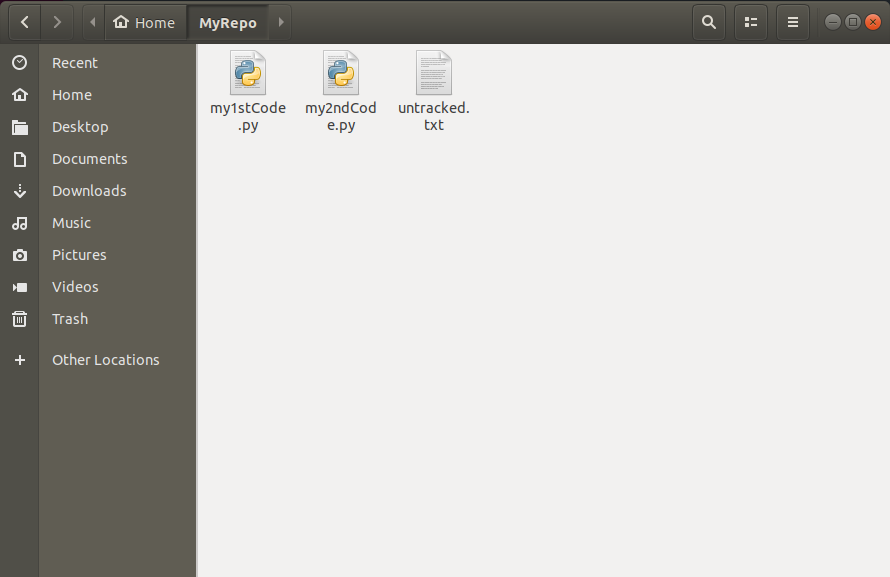
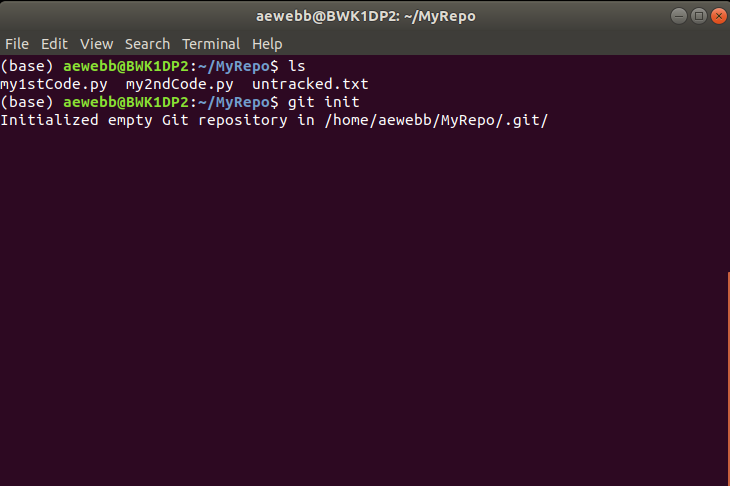
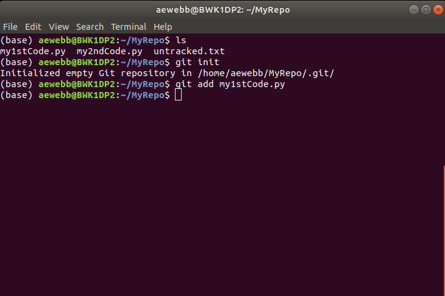
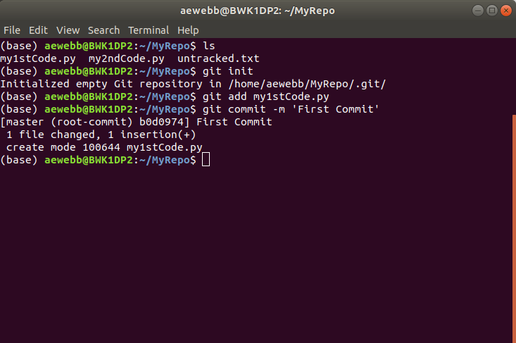

Git and GitHub
==============

Creating a Repository
---------------------

Lets say I’ve been developing some code in the directory \verb|MyRepo| and would like to use Git for version control. Currently I have three files in **MyRepo** - *my1stCode.py*, *my2ndCode.py*, and *untracked.txt* : Figure :numref:`fig-coordsys-rect`.

.. _fig-coordsys-rect:

     
    Contents of the MyRepo directory

Our first step is to initialize Git (i.e. create an empty Git repository) using the *init* command (Figure), please note that this step is only required when creating a new repository and is not required when cloning a repository. 

Once initialized, we may begin version controlling our files. This process requires two steps: 1) we first stage file(s) using the *add* command (Figure); 2) we then are able to commit the staged file(s) using the *commit* command (Figure). Please note, that the *commit* command requires a message, which may be included alongside the command - i.e. *-m 'First Commit'* - or entered using the text editor.

