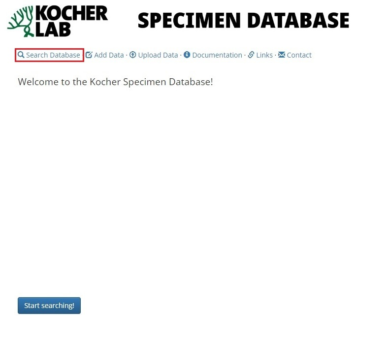
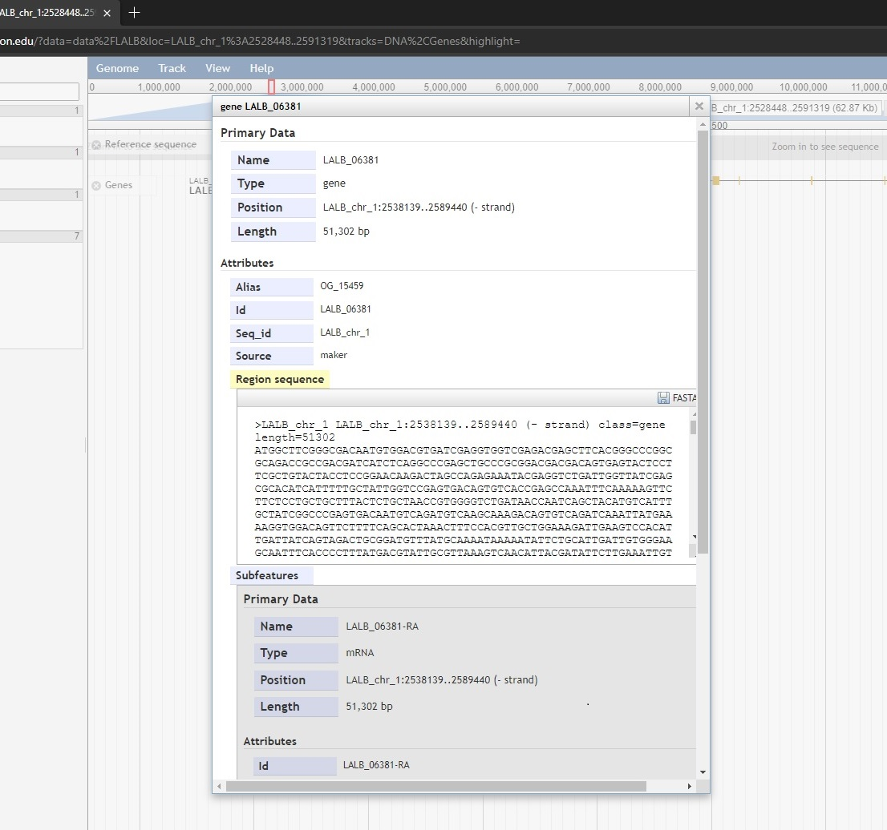
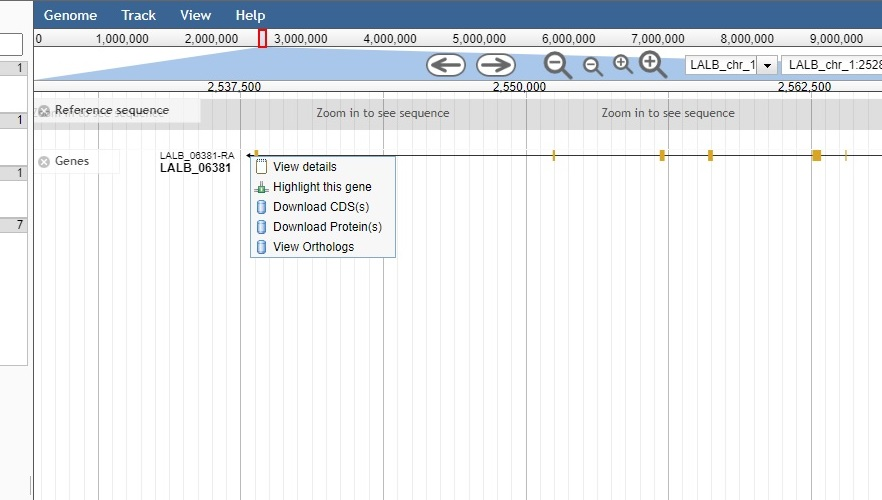

###########################
Kocher Lab Online Resources
###########################

*****************
Specimen Database
*****************
The Kocher lab specimen database may be found at the `Kocher Lab Specimen Database <http://kocherdb.princeton.edu/>`_. By default, the login page will be displayed.

Access to the database requires:

* A Google account or a Princeton account (must be linked to Google)
* Permission for the account to access the database (ask Andrew)

.. figure:: LabResources/SDB_Login.jpg
    :width: 75%
    :align: center
    :figclass: align-center
    :name: Login

    Specimen database login Page

Once granted access to the database, the homepage will be displayed.

     
    Homepage

To begin searching the database, select **Search Database** link and select the table you wish to examine. 

     
    Search the database

     
    Tables within the database

Once a table is selected, it will be displayed below. The displayed data may be downloaded by clicking either **CSV** or **Excel**.

.. figure:: LabResources/SDB_Download.jpg
    :width: 75%
    :align: center
    :figclass: align-center
    :name: Download
     
    Download data from the table

**********************************************
Beenomes: Genome Browser and Sequence Database
**********************************************
The Kocher lab genome browser and sequence database may be found at the `Halictid Genome Browser <https://beenomes.princeton.edu/>`_. This page requires no special login and is available to the public. The homepage hosts links to access the genome browser and/or download the genomes (which are also available on Argo).

     
    Beenomes Homepage

.. figure:: LabResources/BG_Browser.jpg
    :width: 75%
    :align: center
    :figclass: align-center
    :name: BG_browser
     
    Selecting the genome browser

As an example, to access the genome browser for *Lasioglossum albipes* (LALB) you scroll until you reach the image of LALB, then click on the image.

     
    Selecting LALB

The LALB genome browser (built using Jbrowse) will then be loaded. Like the UCSS genome browser, additional information may be displayed by selecting additional tracks.

     
    Available tracks

It’s also possible to search the database for:

* Genes
* Ortholog Groups
* Chromosomal positions

If possible, the result will then be displayed.

     
    Search the database

It’s also possible to simply zoom in to better display a gene of interest. To bring up additional information for a gene, one may:

* Left click to display relevant details
* Right click to display options, including links to the sequence database

     
    Zoomed-in gene

     
    Left click to view details

     
    Right click to view options, and access the sequence database
