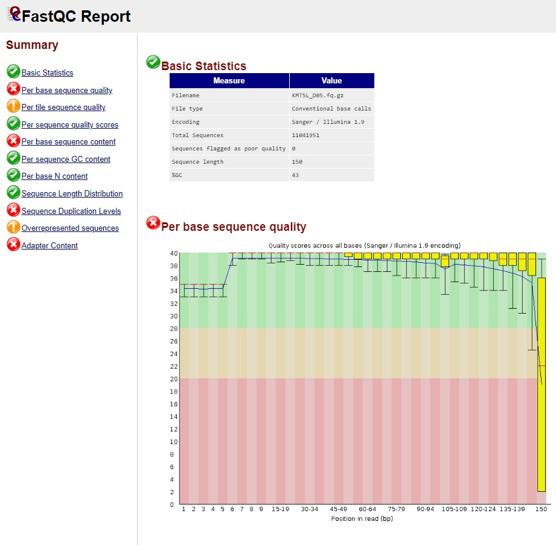
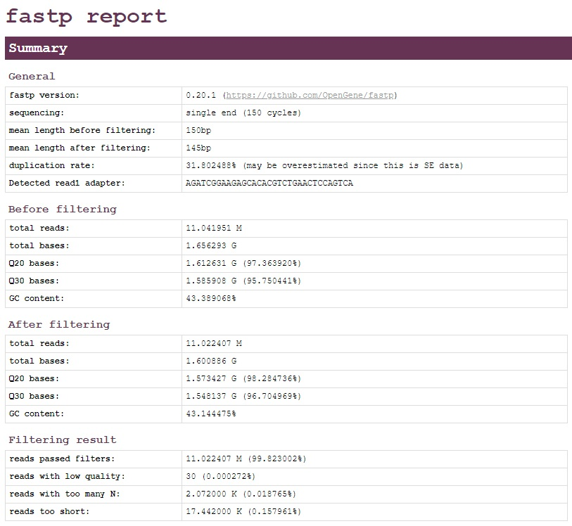

##########################
RNA-seq Tools and Analyses
##########################
The primary purpose of the following documentation is to give insight into the various steps, procedures, and programs used in typical RNA-seq analyses. In the sections below, you will find details on the basic usage of various software packages. Please note that the majority of software packages listed below accept additional arguments that may be found within their documentation. Links to the documentation (and other important information) may be found within the **Useful Links** section of each software package.

********************
Quality Control (QC)
********************
“Garbage in, garbage out” is a concept popular among bioinformaticians to highlight an immutable truth; the quality of an analysis (i.e. the output) is dependent on the quality of the input. Therefore, most bioinformatic pipelines begin with QC steps to identify and remove data that may be detrimental to an analysis. 

All QC programs may be imported using:

.. code-block:: bash
   :name: kocher_RNA1

   conda activate kocher_RNA

FastQC
======
A simple and straightforward method to identify quality concerns within BAM, SAM or FASTQ files. The output from FastQC is an HTML file that may be viewed in any browser (e.g. chrome) :numref:`(Fig. %s) <fastQC_fig>`. The output contains eleven sections flagged as either *Pass* (green check mark), *Warn* (yellow exclamation mark), or *Fail* (red X). It should be noted that all sections of the output should be examined, rather than just sections marked as *Warn* and *Fail*, to determine the best selection of  filters to apply.

     
    FastQC Output

Usage
-----
.. code-block:: bash
   :name: FastQC

   # Running FastQC on a single file
   fastqc KMT5L_D05.fq.gz

   # Running FastQC on multiple files
   fastqc KMT5L_D05.fq.gz KMT6L_A04.fq.gz KMT6L_A12.fq.gz

Useful Links
------------
* `Documentation <https://www.bioinformatics.babraham.ac.uk/projects/fastqc/Help/>`_
* `Reference \(website\) <http://www.bioinformatics.babraham.ac.uk/projects/fastqc/>`_
* `Github <https://github.com/s-andrews/FastQC>`_

----

fastp
=====
A comprehensive and rapid filtering method for FASTQ files. fastp is able to perform quality control, adapter trimming, quality filtering, per-read quality pruning, and many other operations. Most analyses will require at least two operations: 1) adapter trimming and 2) per read trimming by quality score. 

Adapter trimming includes various options from defining adapter sequences on the command-line to adapter auto-detection; adapter trimming may also be disabled, if desired. 

**Trimming by quality score includes three methods:**

:--cut_front:
  Move a sliding window 5' to 3’, drop the bases in the window if its mean quality is below a specified threshold.
:--cut_tail:
  Move a sliding window 3' to 5’, drop the bases in the window if its mean quality is below a specified threshold. 
:--cut_right:
  Move a sliding window 5' to 3’, if the mean quality of a window is below a specified threshold, drop the window and the sequence to the right (i.e. 3’).

Many of these methods may be altered to be similar to functions within the `Trimmomatic package <http://www.usadellab.org/cms/?page=trimmomatic>`_, if desired.

The output from fastp is an HTML file that may be viewed in any browser (e.g. chrome) :numref:`(Fig. %s) <fastp_fig>` and a JSON file that may be used for further interpreting. The HTML contains details on the input before and after the filtering process.

     
    fastp Output

Usage
-----
.. code-block:: bash
   :name: fastp

   # Single end data
   fastp -i KMT5L_D05.fq.gz -o KMT5L_D05.filtered.fq.gz

   # Paired end data
   fastp -i KMT5L_D05.R1.fq.gz -I KMT5L_D05.R2.fq.gz -o KMT5L_D05.filtered.R1.fq.gz -O KMT5L_D05.filtered.R2.fq.gz

   # Paired end data with paired end adapter auto-detection
   fastp -i KMT5L_D05.R1.fq.gz -I KMT5L_D05.R2.fq.gz -o KMT5L_D05.filtered.R1.fq.gz -O KMT5L_D05.filtered.R2.fq.gz --detect_adapter_for_pe

   # Paired end data using the the cut_right method with a
   # window size of 3 and a mean Phred quality of 20
   fastp -i KMT5L_D05.R1.fq.gz -I KMT5L_D05.R2.fq.gz -o KMT5L_D05.filtered.R1.fq.gz -O KMT5L_D05.filtered.R2.fq.gz --cut_right --cut_right_window_size 3 --cut_right_mean_quality 20

Useful Links
------------
* `Documentation <https://github.com/OpenGene/fastp/blob/master/README.md>`_
* `Reference \(Chen et al\.\, 2018\) <https://academic.oup.com/bioinformatics/article/34/17/i884/5093234>`_
* `Github <https://github.com/OpenGene/fastp>`_
* `Phred scores <https://en.wikipedia.org/wiki/Phred_quality_score>`_

**********************
RNA-seq Read Alignment
**********************
In computational biology, sequence alignment is a process used to identify regions of similarity between sequences. An inherent challenge of RNA-seq read alignment is the mapping of sequences from non-contiguous genomic regions – i.e. the mRNAs. At present, two strategies of RNA-seq read alignment have been developed and thoroughly tested: i) traditional alignment to genomic sequence data and ii) pseudoalignment to transcript sequences. Research has shown that both strategies - when applied by highly-accurate algorithms - produce similar ressults \(`Costa-Silva et al\.\, 2017 <https://journals.plos.org/plosone/article?id=10.1371/journal.pone.0190152>`_\). 

All RNA-seq Read Alignment programs may be imported using:

.. code-block:: bash
   :name: kocher_RNA2

   conda activate kocher_RNA

Input Files Types
=================
Depending on the preferred alignment strategy, the relevant input file(s) may be found among the following three file types:

* `Genomic Sequence \(FASTA format\) <https://ftp.ncbi.nlm.nih.gov/genomes/all/GCF/003/254/395/GCF_003254395.2_Amel_HAv3.1/GCF_003254395.2_Amel_HAv3.1_genomic.fna.gz>`_
* `Genome annotation  \(GFF format\) <https://ftp.ncbi.nlm.nih.gov/genomes/all/GCF/003/254/395/GCF_003254395.2_Amel_HAv3.1/GCF_003254395.2_Amel_HAv3.1_genomic.gff.gz>`_
* `Transcript Sequences File \(FASTA format\) <https://ftp.ncbi.nlm.nih.gov/genomes/all/GCF/003/254/395/GCF_003254395.2_Amel_HAv3.1/GCF_003254395.2_Amel_HAv3.1_rna.fna.gz>`_

Note: all example files may be found within the NCBI genome page for `Apis mellifera HAv3\.1 <https://www.ncbi.nlm.nih.gov/genome/?term=txid7460>`_.

Input Conversion
================
It should be noted that some of the methods in this section may require a file conversion step for an input file to be compatible and function correctly.

Genome Annotation: GFF to GTF
-----------------------------
This may be done using **gffread**.

.. code-block:: bash
   :name: gffread

   gffread GCF_003254395.2_Amel_HAv3.1_genomic.gff -T -o GCF_003254395.2_Amel_HAv3.1_genomic.gtf

Transcript/Gene Conversion File
-------------------------------
This may be done using **create_tid_converter.py** using a GFF as an input.

.. code-block:: bash
   :name: tid_converter

   create_tid_converter.py GCF_003254395.2_Amel_HAv3.1_genomic.gff.gz GCF_003254395.2_Amel_HAv3.1_genomic.tid_to_gid2.csv

----

STAR
====
A rapid and highly accurate, but memory intensive, traditional alignment capable of producing either SAM or BAM files. Alignment requries two operations: 1) indexing a reference genome and 2) read alignment. 

Indexing
--------
Indexing requires two input files to operate:

* **Genomic sequence**
* **Genome annotation**

Arguments
^^^^^^^^^
:--runMode genomeGenerate:
  Required to set the run-mode to indexing
:--runThreadN <thread_int>:
  Defines the number of threads for indexing
:--genomeDir <output_dir>:
  Defines the name of the output index directory
:--genomeFastaFiles <fasta_file>:
  Defines the name of the genomic sequence in fasta format
:--sjdbGTFfile <gtf_file>:
  Defines the name of the genomic annotation in GTF format
:--sjdbOverhang <overhang_int>:
  Defines the maximum overhang for a read, may be calculated by: *read_length - 1*
:--limitGenomeGenerateRAM <RAM_int>:
  Defines the RAM limit for indexing in bytes

.. code-block:: bash
   :name: star_index

   STAR --runThreadN 10 --runMode genomeGenerate --genomeDir AMEL_Index --genomeFastaFiles GCF_003254395.2_Amel_HAv3.1_genomic.fna --sjdbGTFfile GCF_003254395.2_Amel_HAv3.1_genomic.gtf --sjdbOverhang 99 --limitGenomeGenerateRAM 38000000000

Read Alignment
--------------
Read alignment requires two input files to operate:

* **Indexed Genome (from previous section)**
* **Fastq Reads (SE or PE)**

Arguments
^^^^^^^^^
:--runMode alignReads:
  Required to set the run-mode to read alignment
:--runThreadN <thread_int>:
  Defines the number of threads for read alignment
:--genomeDir <output_dir>:
  Defines the name of the index directory
:--readFilesIn <se_fastq_filename>, <pe_fastq_filename pe_fastq_filename>:
  Defines the fastq filenames to align to the index. Please note: when using paired-end reads a space is placed between the files
:--readFilesCommand zcat:
  Defines the read method for gzipped fastq files. Only required when using fastq.gz
:--outSAMtype <format_strs>:
  Defines the output format, if SAM is not desired. See below for options
:--outFileNamePrefix <output_prefix>:
  Defines the output prefix name

Output Options
^^^^^^^^^^^^^^
:--outSAMtype BAM Unsorted:
  Defines the output format as unsorted BAM
:--outSAMtype BAM SortedByCoordinate:
  Defines the output format as sorted BAM
:--outSAMtype BAM Unsorted SortedByCoordinate:
  Defines the output format as seperate sorted and unsorted BAM files

.. code-block:: bash
   :name: star_alignment

   # Alignment w/ single-end fastq input
   STAR --runThreadN 10 --runMode alignReads --genomeDir AMEL_Index --outSAMtype BAM Unsorted --outFileNamePrefix AMEL1. --readFilesCommand zcat --readFilesIn AMEL1.filtered.fastq.gz

   # Alignment w/ paired-end fastq input
   STAR --runThreadN 10 --runMode alignReads --genomeDir AMEL_Index --outSAMtype BAM Unsorted --outFileNamePrefix AMEL2. --readFilesCommand zcat --readFilesIn AMEL2_1.filtered.fastq.gz AMEL2_2.filtered.fastq.gz

Useful Links
------------
* `Documentation <https://github.com/alexdobin/STAR/blob/master/doc/STARmanual.pdf>`_
* `Reference \(Dobin et al\.\, 2012\) <https://academic.oup.com/bioinformatics/article-lookup/doi/10.1093/bioinformatics/bts635>`_
* `Github <https://github.com/alexdobin/STAR>`_

Gene Quantification STAR Results w/ featureCounts
-------------------------------------------------
A simple and straightforward method from the subread package to estimate gene counts from BAM files.  that only requries a **Genome annotation**.

Arguments
^^^^^^^^^
:-a <gtf_file>:
  Defines the name of the genomic annotation
:-T <thread_int>:
  Defines the number of threads for read alignment
:-o <output_file>:
  Defines the filename of the count output
:<BAM File>:
  The filename of the **BAM File** *Note: Positional argument*

.. code-block:: bash
   :name: star_quant

   featureCounts -T 10 -a GCF_003254395.2_Amel_HAv3.1_genomic.gt -o AMEL2_featurecounts.txt AMEL2.out.bam

Useful Links
^^^^^^^^^^^^
* `Documentation <http://bioinf.wehi.edu.au/subread-package/SubreadUsersGuide.pdf>`_
* `Reference \(Liao et al\.\, 2014\) <https://academic.oup.com/bioinformatics/article-lookup/doi/10.1093/bioinformatics/btt656>`_
* `Homepage <http://subread.sourceforge.net/>`_

----

kallisto
========
A rapid, highly accurate, and memory efficient pseudoalignment method for quantifying abundances of transcripts. Alignment requries two operations: 1) indexing a reference genome and 2) transcript quantification. 

Indexing
--------
Indexing requires only the **Transcript Sequences File** and an index filename to be assigned using the following arguments:

Arguments
^^^^^^^^^
:index:
  Required to set the run-mode to indexing *Note: Positional argument* 
:-T <thread_int>:
  Defines the number of threads for read alignment
:<Transcript Sequences File>:
  The filename of the **Transcript Sequences File** *Note: Positional argument*

.. code-block:: bash
   :name: kallisto_index

   kallisto index -i GCF_003254395.2_Amel_HAv3.1_rna.idx GCF_003254395.2_Amel_HAv3.1_rna.fna.gz

Transcript Quantification
-------------------------
Transcript quantification requires two input files to operate:

* **Indexed Transcripts (from previous section)**
* **Fastq Reads (SE or PE)**

Common Arguments
^^^^^^^^^^^^^^^^
:quant:
  Required to set the run-mode to transcript quantification *Note: Positional argument*
:-i <index_filename>:
  Defines the filename of the index
:-t <thread_int>:
  Defines the number of threads for transcript quantification
:-b <bootstrap_int>:
  Defines the number of bootstrap samples
:-o <output_dir_name>:
  Defines the name of the output directory
:FASTQ Read Files:
  The filenames of the **FASTQ Read Files** *Note: Positional argument*
Single-end Mode
^^^^^^^^^^^^^^^
* **--single**: Required to set the run-mode to single-end transcript quantification
* **-l** *length_float*: Defines the estimated average fragment length
* **-s** *stdev_float*: Defines the estimated standard deviation of fragment length

Output Options
^^^^^^^^^^^^^^
* **--pseudobam**: Defines if pseudoalignments should be saved to a transcriptome to BAM file
* **--genomebam**: Defines if pseudoalignments should be projected onto a genome-sorted BAM file. *Note: Requries* **--gtf** *to operate*
* **--gtf** *gtf_filename*: Defines the name of the genomic annotation in GTF format

.. code-block:: bash
   :name: kallisto_quant

   # Alignment w/ single-end fastq input
   kallisto quant -i GCF_003254395.2_Amel_HAv3.1_rna.idx -b 100 -t 10 -l 45.552 -s 5.225 -o AMEL1 AMEL1.filtered.fastq.gz

   # Alignment w/ paired-end fastq input
   kallisto quant -i GCF_003254395.2_Amel_HAv3.1_rna.idx -b 100 -t 10 -o AMEL2 AMEL2_1.filtered.fastq.gz AMEL2_2.filtered.fastq.gz

Useful Links
------------
* `Documentation <https://pachterlab.github.io/kallisto/manual>`_
* `Reference \(Bray et al\.\, 2016\) <https://www.nature.com/articles/nbt.3519>`_
* `Homepage <https://pachterlab.github.io/kallisto/>`_

----

********************************
Differential Expression Analysis
********************************
A common use of multiple transcriptome datasets is the search for differentially expressed (DE) genes - i.e. genes that show *significant* differences in expression level between conditions, experimental groups, etc. Many statistical analyses have been developed to perform differential expression analysis (DEA), however, please note that they will likely produce different results \(`Costa-Silva et al\.\, 2017 <https://journals.plos.org/plosone/article?id=10.1371/journal.pone.0190152>`_, ADD OTHER REFS\).

All DEA programs may be imported using:

.. code-block:: bash
   :name: kocher_DEA

   conda activate kocher_DEA

Input Files Types
=================
Depending on the preferred alignment strategy, the relevant input file(s) may be found among the following three file types:

* :download:`Count Matrix File <RNA_seq/count_matrix.tsv>`
* :download:`Sample Groups File <RNA_seq/sample_groups.csv>`
* kallisto Transcript Abundance File (i.e. abundance.h5)
* `Genome annotation  \(GFF format\) <https://ftp.ncbi.nlm.nih.gov/genomes/all/GCF/003/254/395/GCF_003254395.2_Amel_HAv3.1/GCF_003254395.2_Amel_HAv3.1_genomic.gff.gz>`_

Input Conversion
================
It should be noted that some of the methods in this section may require a file conversion step for an input file to be compatible and function correctly.

Transcript/Gene Conversion File
-------------------------------
This may be done using **create_tid_converter.py** using a GFF as an input.

.. code-block:: bash
   :name: tid_converter

   create_tid_converter.py GCF_003254395.2_Amel_HAv3.1_genomic.gff.gz GCF_003254395.2_Amel_HAv3.1_genomic.tid_to_gid2.csv

----

DESeq2
======
A well-studied and thoroughly compared method to identify DE genes using count data. DESeq2 by itself is only capable of accepting count data, such as the output from STAR and featureCounts. However, by using tximport - a program written by DESeq2 developers - it is possible to use other data types, such as transcript abundance data from kallisto. Below you will find commented R scripts for: 1) STAR and featureCounts and 2) kallisto.

Count Data Usage
^^^^^^^^^^^^^^^^
.. code-block:: bash
   :name: deseq2_count

   library("DESeq2") # Import DESeq2
   cts <- as.matrix(read.csv("count_matrix.tsv",sep="\t",row.names="gene_id")) # Read in the count matrix
   coldata <- read.csv("sample_groups.csv", row.names=1) # Read in the sample groups
   coldata <- coldata[,c("group","type")] # Limit the columns in the sample groups to group and type
   coldata$group <- factor(coldata$group) # Categorize and save the sample group data
   coldata$type <- factor(coldata$type) # Categorize and save the sample type data
   dds <- DESeqDataSetFromMatrix(countData = cts, colData = coldata, design = ~ group) # Create a DESeq object from the count matrix
   dds <- DESeq(dds) # Run DESeq
   res <- results(dds) # Save the results
   resOrdered <- res[order(res$pvalue),] # Save the adjusted p-values
   write.csv(as.data.frame(resOrdered), file="DESeq2_count_matrix.csv") # Create a csv of results w/adjusted p-values

Transcript Abundance Usage
^^^^^^^^^^^^^^^^^^^^^^^^^^
.. code-block:: bash
   :name: deseq2_abundance

   library("DESeq2") # Import DESeq2
   library(tximport) # Import tximport
   samples <- read.table(file.path("sample_groups.csv"), header = TRUE, sep = ",") # Read in the sample groups
   files <- file.path("../../kallisto", samples$file, "abundance.h5") # Assign paths to transcript abundance files (e.g. kallisto/ERR883768_1/abundance.h5)
   names(files) <- samples$file # Assign each path with its sample id (e.g. ERR883768_1)
   tx2gene <- read.table(file.path("../../../Genome/GCF_000214255.1_Bter_1.0_genomic.tid_to_gid.csv"), header = FALSE, sep = ",") # Read in the transcript/gene conversion file
   txi <- tximport(files, type = "kallisto", tx2gene = tx2gene) # Read in the kallisto files and convert the transcript abundances to gene abundances
   coldata <- read.csv("sample_groups.csv", row.names=1) # Read in the sample groups
   coldata <- coldata[,c("group","type")] # Limit the columns in the sample groups to group and type
   coldata$group <- factor(coldata$group) # Categorize and save the sample group data
   coldata$type <- factor(coldata$type) # Categorize and save the sample type data
   dds <- DESeqDataSetFromTximport(txi, coldata, ~group) # Create a DESeq object from the tximport data
   dds <- DESeq(dds) # Run DESeq
   res <- results(dds) # Save the results
   resOrdered <- res[order(res$pvalue),] # Save the adjusted p-values
   write.csv(as.data.frame(resOrdered), file="DESeq2_kallisto.csv") # Create a csv of results w/adjusted p-values

Useful Links
------------
* `DESeq2 Documentation <https://bioconductor.org/packages/release/bioc/vignettes/DESeq2/inst/doc/DESeq2.html>`_
* `DESeq2 Reference Manual <https://bioconductor.org/packages/release/bioc/manuals/DESeq2/man/DESeq2.pdf>`_
* `DESeq2 Reference \(Love et al\.\, 2014\) <https://genomebiology.biomedcentral.com/articles/10.1186/s13059-014-0550-8>`_
* `DESeq2 Homepage <https://bioconductor.org/packages/release/bioc/html/DESeq2.html>`_
* `tximport Documentation <https://bioconductor.org/packages/release/bioc/vignettes/tximport/inst/doc/tximport.html>`_
* `tximport Reference Manual <https://bioconductor.org/packages/release/bioc/manuals/tximport/man/tximport.pdf>`_
* `tximport Reference \(Soneson et al\.\, 2015\) <https://f1000research.com/articles/4-1521/v1>`_
* `tximport Homepage <https://bioconductor.org/packages/release/bioc/html/tximport.html>`_