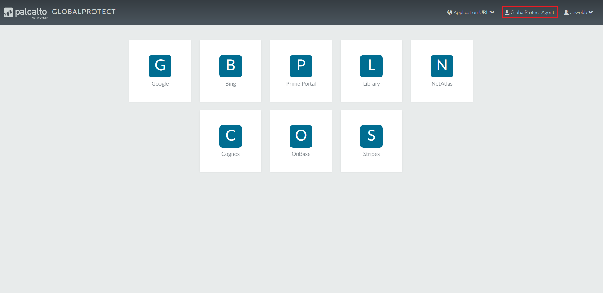
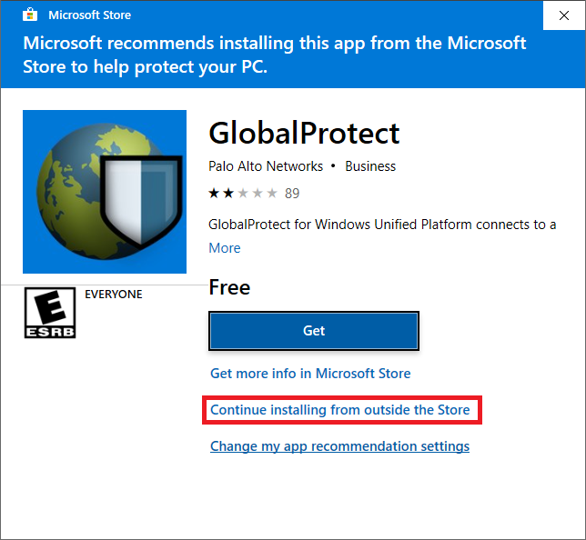
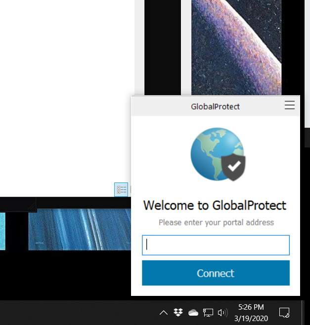
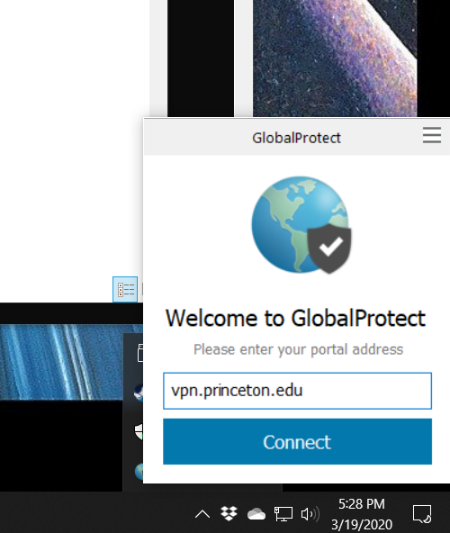
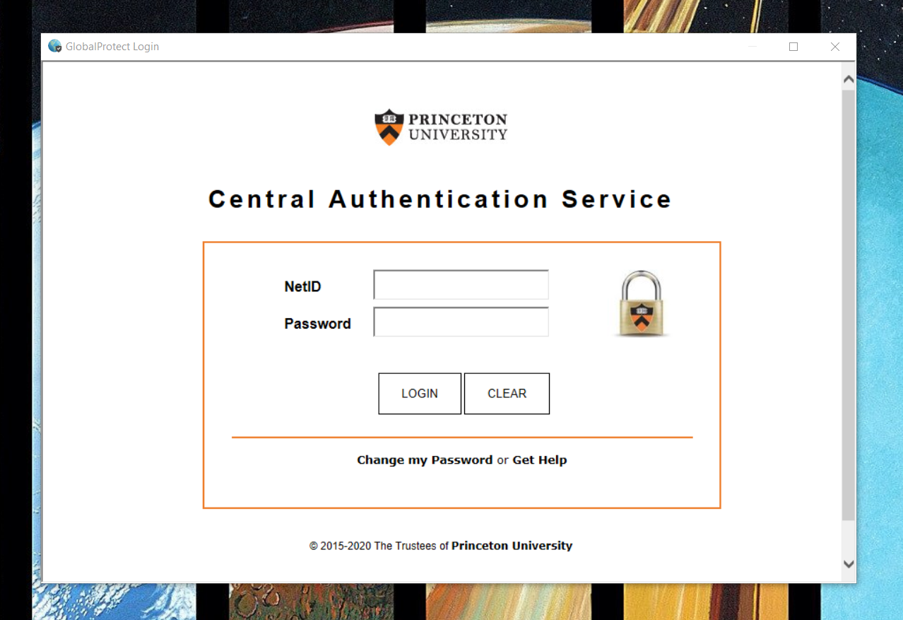
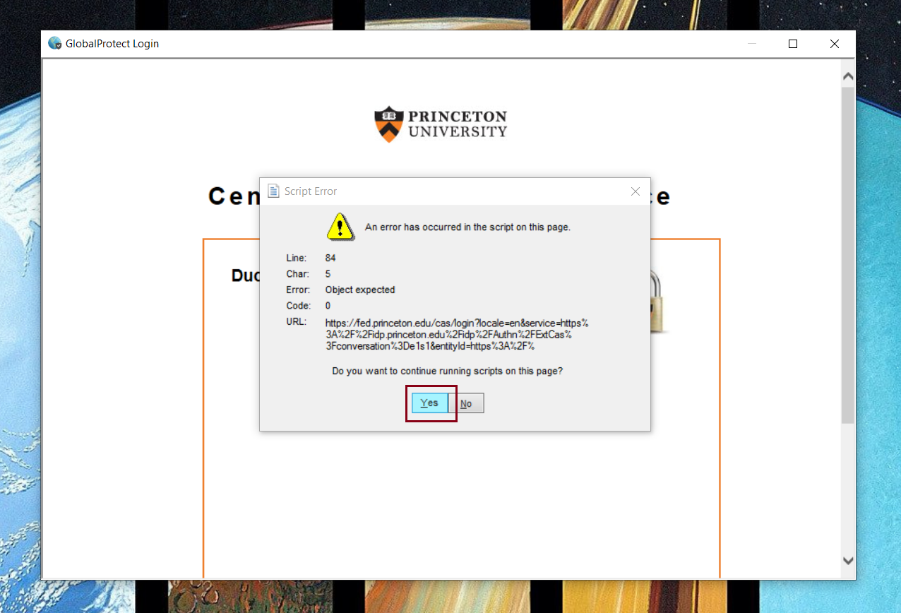
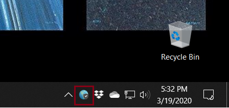

#############################
VPN Installation Instructions
#############################

**********************
Download GlobalProtect
**********************
1. Visit the `GlobalProtect VPN <https://vpn.princeton.edu/>`_ web portal.
2. Enter your Princeton NetID, your password, and click Log in. 
3. Wait for Duo to send a request to your default device and approve the Duo request.
4. To download, click on the GlobalProtect Agent :numref:`(see red box %s) <webPortal>`.

     
    GlobalProtect VPN web portal

5. On Windows - Select Continue installing from outside the Store :numref:`(see red box %s) <install>`.

     
    GlobalProtect Install

6. You will see the GlobalProtect Setup Wizard. The installer will guide you through the steps required to install the software. Click Next.
7. On the Select Installation Folder screen, click Next.
8. On the Confirm Installation screen, click Next.
9. On the Account Control pop-up, enter an admin user name and password. You will be asked, “Do you want to allow this app to make changes to your device?” Click Yes.
10. On the Installation Complete screen, click Close to exit.
11. Once installed, you should see the following pop-up :numref:`(see image %s) <vpnNOIP>` on your desktop.

12. Type vpn.princeton.edu in the text box :numref:`(see image %s) <vpnIP>`, click Connect.

13. Enter your Princeton NetID, your password, and click Log in :numref:`(see image %s) <duo>`.

14. A pop-up should then appear. Click Yes :numref:`(see image %s) <popUP>`.
15. Wait for Duo to send a request to your default device and approve the Duo request.

If you have connected, you should see a small blue globe on your taskbar :numref:`(see image %s) <globe>`.

